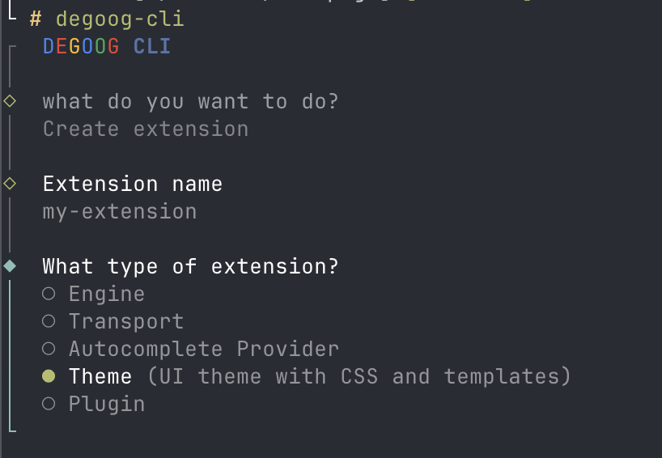
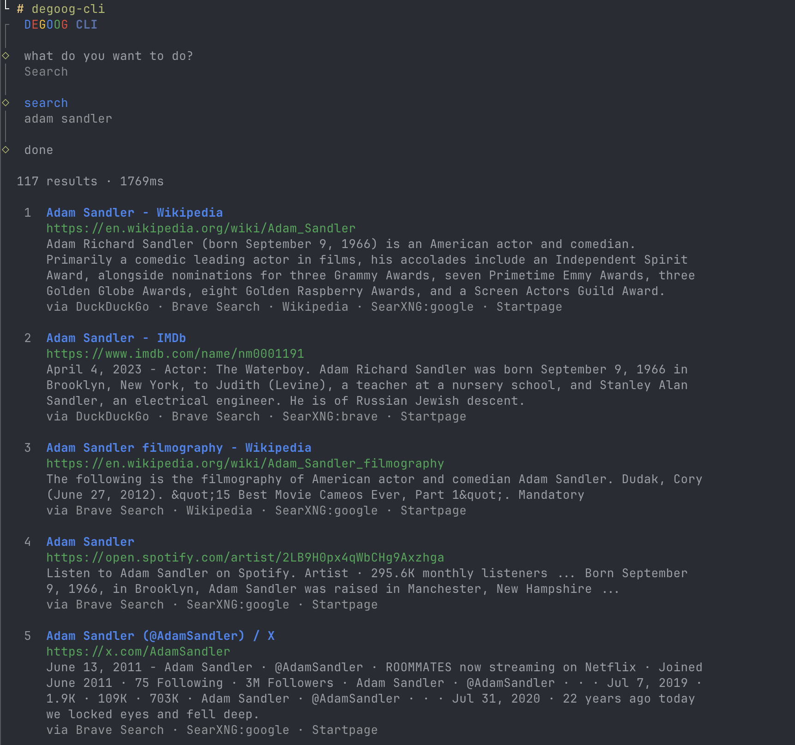

# degoog-cli

CLI tool for scaffolding degoog extensions and searching your instance from the terminal.

<p align="center">
  
  <br />
  
</p>

## Install

```sh
curl -fsSL https://raw.githubusercontent.com/degoog-org/cli/main/install.sh | sh
```

The installer asks whether you want Docker or a native binary. Docker is recommended - no runtime dependencies, always up to date with a pull. Native binaries are available for Linux x64/arm64 and macOS x64/arm64. Windows users should use Docker.

Once installed, run it from anywhere:

```sh
degoog-cli
```

<details>
<summary>Manual install for the nerds</summary>

**Docker Compose**

Grab the `docker-compose.yml` from this repo and run it from any directory:

```sh
curl -fsSL https://raw.githubusercontent.com/degoog-org/cli/main/docker-compose.yml -o docker-compose.yml
docker compose run --rm degoog-cli
```

Extensions are created in whichever directory you run it from. Config persists at `~/.config/degoog` on your host.

**Native binary**

Download the binary for your platform from [releases](https://github.com/degoog-org/cli/releases/latest), make it executable, and put it on your `$PATH`:

```sh
# Linux x64 example
curl -fsSL https://github.com/degoog-org/cli/releases/latest/download/degoog-cli-linux-x64 \
  -o /usr/local/bin/degoog-cli
chmod +x /usr/local/bin/degoog-cli
```

Available filenames: `degoog-cli-linux-x64`, `degoog-cli-linux-arm64`, `degoog-cli-darwin-x64`, `degoog-cli-darwin-arm64`.

</details>

## Setup

Run login once to point the CLI at your instance and save your author details:

```sh
degoog-cli
```

Pick **Login / Setup** from the menu. Instance URL and API key unlock the search command.

## Search

Select **Search** from the menu to search your degoog instance directly from the terminal. Results show inline with title, URL, snippet, and sources. Pick a result to open it in your browser or keep searching.

Requires an instance URL to be configured.

## Create an extension

Select **Create extension** from the menu and follow the prompts, or skip them with flags:

```sh
degoog-cli create --name my-engine --type engine --out ./extensions
```

Any flag you omit will still be asked interactively, unless the CLI is running headless (see below). Available types:

| Type                | What it is                                                  |
| ------------------- | ----------------------------------------------------------- |
| `engine`            | Custom search engine                                        |
| `transport`         | Custom HTTP fetch strategy                                  |
| `autocomplete`      | Search suggestions provider                                 |
| `favicon`           | Favicon provider for search results                         |
| `theme`             | UI theme with CSS variables and optional template overrides |
| `plugin-bang`       | Bang command (`!trigger query`)                             |
| `plugin-slot`       | Panel injected into search results                          |
| `plugin-tab`        | Custom tab in search results                                |
| `plugin-intercept`  | Modifies queries before search                              |
| `plugin-middleware` | Hooks into request flows                                    |
| `plugin-routes`     | Custom HTTP endpoints                                       |

## What gets generated

Every extension gets:

- `index.ts` - entry file pre-filled with the correct contract for the type you picked (favicon providers get `index.js`, matching the official store)
- `README.md` - fill this in, it shows as docs on the extension's settings page
- `author.json` - auto-filled from your login details

Themes also get `style.css` with all CSS variables pre-filled to the degoog defaults (light and dark), plus a `templates/logo.html` example showing how to override a template section.

The generated theme README also covers the script-free `/nojs` page, which reuses your ordinary templates and takes per-file overrides from a `nojs/` folder by filename instead of through `theme.json`.

Plugin types also have `isClientExposed` already in the template. Set it to `true` if your plugin causes the browser to fetch external URLs directly, `false` if everything goes through the server. Leaving it unset shows a warning badge in degoog settings.

Engines ask whether the site puts an Anubis proof-of-work page in front of its results. Answer yes and the template sets `challenges: ["anubis"]`, so degoog solves the page before your engine reads the response. Inside a store, the package.json entry also gets `minDegoogVersion: "1.0.0"`, because degoog solves these pages from 1.0.0 onwards.

Transports ask whether they drive a real browser that gets through proof-of-work pages. Answer yes and the template sets `handlesChallenges: true`, so degoog leaves those pages to the engine.

Doctor checks both values. It fails on an unknown `challenges` kind or a `handlesChallenges` that isn't `true` or `false`, and warns when an engine with `challenges` has a `minDegoogVersion` below 1.0.0.

## Running without prompts

Every command also runs with no interactive UI, for scripts, CI, or piping. The CLI goes headless when you pass `-y` / `--yes`, when stdin or stdout is not a terminal, or when `CI` or `DEGOOG_HEADLESS=1` is set. Headless runs never prompt: they read flags, fall back to defaults, and exit `1` when a required value is missing or a check fails. Colours are dropped when output is not a terminal, or with `--no-color` / `NO_COLOR`.

```sh
degoog-cli login --yes --instance-url https://search.example.com --api-key "$DEGOOG_API_KEY" --username "Jane Dev"
degoog-cli create --yes --name my-engine --type engine --challenges
degoog-cli create --yes --name my-theme --type theme --init-store --include css,home-logo
degoog-cli search --json --limit 5 "degoog extensions"
degoog-cli doctor ./my-store --fix --plugin-type command
```

| Command  | Flags                                                                                                                                       | Headless defaults                                                                             |
| -------- | ------------------------------------------------------------------------------------------------------------------------------------------- | --------------------------------------------------------------------------------------------- |
| `create` | `--name`, `--type`, `--out`, `--init-store`, `--challenges`, `--handles-challenges`, `--include <parts\|all>`                               | `--name` and `--type` are required. Output goes to the detected store category, otherwise `.` |
| `search` | `<query>`, `--json`, `--limit <n>`                                                                                                          | Query is required. `--json` always skips the result browser                                   |
| `login`  | `--instance-url` (or `DEGOOG_INSTANCE_URL`), `--api-key` (or `DEGOOG_API_KEY`), `--username`, `--website`                                   | Only the values you pass are changed                                                          |
| `doctor` | `[path]`, `--fix`, `--plugin-type <command\|slot\|interceptor\|search-result-tab>`                                                          | Path defaults to the current directory. Orphan folders are only registered with `--fix`       |

Boolean flags accept `--flag=false`. Themes created headless without `--include` get `css` only. Orphan plugin folders are skipped unless `--plugin-type` is given, since doctor cannot guess their type. Run `degoog-cli --help` for the full list.

## Docker Compose

If you prefer compose over the wrapper script:

```sh
docker compose run --rm degoog-cli
```

Extensions land in your current directory. Config persists at `~/.config/degoog` on your host.

## Dev (building from source)

Requires [Bun](https://bun.sh).

```sh
bun install
bun run dev        # run without building
bun run build      # produces binaries in dist/ for all platforms
```
